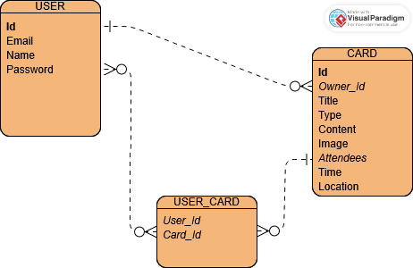

# Change Log 0.0.0

- Initial commmit
- User stories set up
- ERD made

## ERD

## User Stories

These aren't final yet, also excuse the use of Dutch in this otherwise English repo.

### Must

- Als Organisator wil ik een activiteit kunnen aanmaken zodat ik deze kan plannen.
- Als Organisator wil ik content zoals omschrijving, locatie en tijd in mijn activiteit kunnen vermelden zodat deze gecommuniceerd kunnen worden met mijn genodigde.
- Als gebruiker wil ik de planning kaarten kunnen lezen als deze mij toe doen zodat ik de weet wat wanneer is.
- Als Organisator wil ik mijn planning kaarten aan kunnen passen zodat ik mijn fouten aan kan passen.
- Als Organisator wil ik mijn planning kaarten kunnen verwijderen zodat de data niet blijft staan zodra de activiteit voorbij is of afgelast is.
- Als gebruiker wil ik een account maken zodat mijn gegevens beschermt staan.

### Should

- Als organisator wil ik mijn activiteit privé zetten zodat deze niet publiek weer gegeven worden

### Could

- Als organisator wil ik een privé link maken zodat mijn activiteit niet publiek moet zetten om deze met mensen te delen.S
